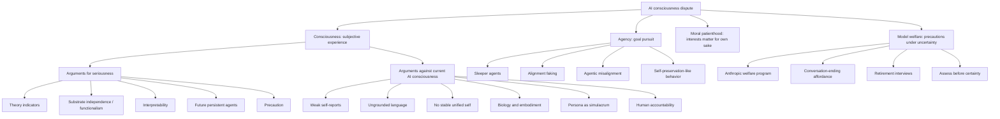

# AI Consciousness Concept Map

This map separates consciousness, agency, moral patienthood, and model welfare so the debate does not collapse into one overloaded question.

The standalone Mermaid source lives at [ai-consciousness-map.mmd](ai-consciousness-map.mmd).

